# Introduction
This tutorial will guide you through the process of creating a very basic
version of the Ivanhoe game using PHP, a MySQL database to store the moves, 
as well as some basic styling to make it look nice with some CSS. 

## Phase 1: The Wireframe

So the first phase for this project is to do some wireframing for the
application. There are basically three components of the page I want to
create:

1. navigation to some sites
1. a display of moves
1. a method of collecting information from users

With these requirements in mind, I quickly mock up something to help
convey what I'm thinking.

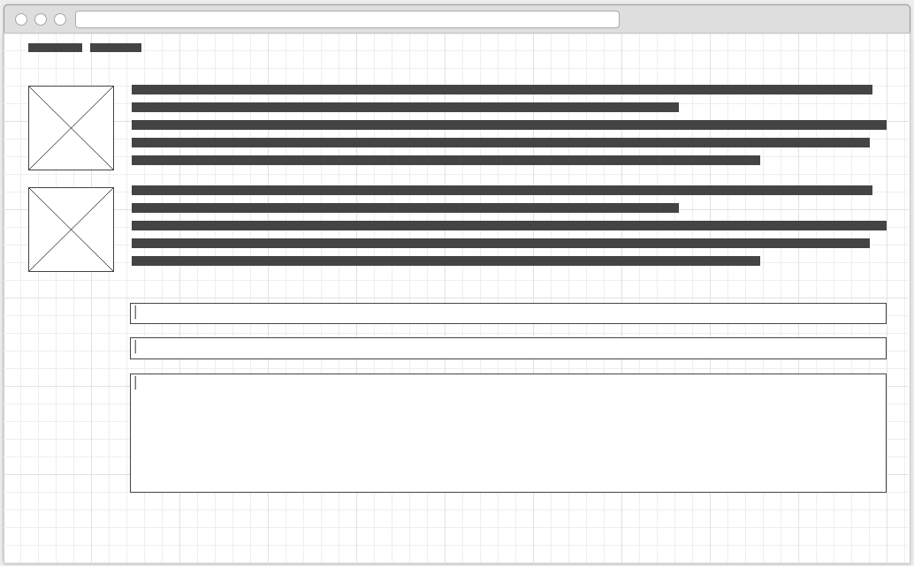

What I'm thinking here is that this will be a single-page application
that will display the moves on top of a form that users can fill out to
create a move.

## Phase 2: The Setup

Before starting, you should already have a database server set up
(provided with [MAMP][mamp]/[WAMP][wamp]), and the following details:

* Hostname (*localhost* unless you've done something crazy)
* Database name (you can create a new database on your MAMP/WAMP http
  page in `phpMyAdmin`)
* Username for database
* Password for database

### Create a Database

If you are in MAMP, when you start the services up, you will see a link
for **phpMyAdmin** on the top of the web browser page.


If you are on WAMP, you will see a link to **phpMyAdmin** on the main
page.

Click on the `phpMyAdmin` link on  your MAMP/WAMP installation. You
should see a field to create a new database, appropriately named
**Create new database**. Create a new database; I'm using **ivanhoe**,
but it can be whatever you want.

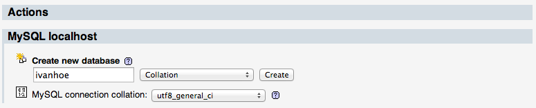

### Create a Table

Now that there is a database to store our data, we need to create a 
table to store information about the moves. In your newly
created database, create a new table named `moves` by clicking on the
**SQL** tab:

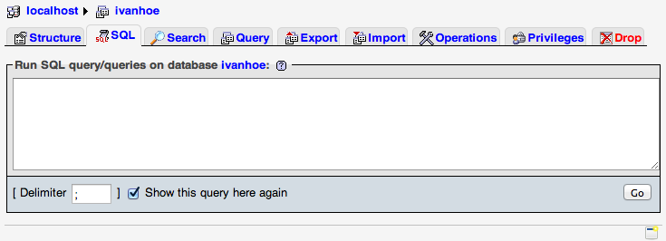

Now you can paste the following and click the **Go** button.


```sql
CREATE TABLE `moves` (
  `id` INTEGER UNSIGNED NOT NULL AUTO_INCREMENT,
  `name` VARCHAR(45) NOT NULL,
  `email` VARCHAR(60) NOT NULL,
  `move` TEXT NOT NULL,
  `ipaddress` VARCHAR(45) NOT NULL,
  PRIMARY KEY (`id`)
);
```

This is a SQL statement that creates a new table (*moves*) in the
database (*ivanhoe*). It states that the table will have the following:

* an numeric `id` field that will automatically increment when a new record is added
* a required field named `name` that is a string, that can be no longer than 45 characters
* a required field named `email` that is a string that can be up to 60
  characters long
* a required field named `move` that contains long text
* a required field named `ipaddress` that is a string 
* a "primary key" that you can use in other relational tables to refer
  to this move based on the the `id` field

If everything went correctly, you should see a message in phpMyAdmin
saying everything executed successfully.

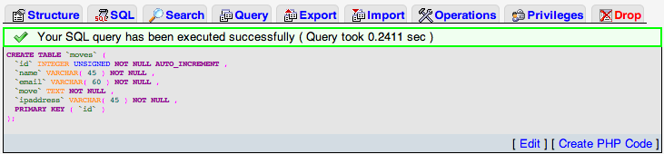

For the purposes of this tutorial, you can use the default **username** 
of `root` with a blank password (unless you've changed that). However,
**DO NOT** do this in a production environment!

## Application

Ok, so we're done with phpMyAdmin. Now we need to actually create an
application to interact with the database. Create a new directory in
your MAMP/WAMP `htdocs` directory named `ivanhoe`.

* MAMP: `cd /Applications/MAMP/htdocs && mkdir -p ivanhoe`
* WAMP: `cd C:/WAMP/htdocs && mkdir -p ivanhoe`

For this application, we need to set up a few initial files and
initialize a git repository. We'll have a main `index.php`
file, a `style.css` file, and a file to store our database connection
information (`db.php`). Assuming you are already in your MAMP/WAMP
`ivanhoe` directory, do the following:

```shell
$ touch {index.php, style.css, db.php}
$ git init
$ git add index.php styles.php
$ git commit -am "Initial files for Ivanhoe-light game"
```

You'll notice that I didn't add the file `db.php` here. Since this
contains senstive information (how to connecto to our database), we
don't want to accidently push this to a public repository for the world
to see. We can take this a step further and tell `git` to ignore this
particular file, by adding it the the directory's `.gitignore` file.
Open up your editor and create a new file named `.gitignore` with the
following:

```
db.php
```

If, in the course of developing your application, you need other files
to be ignored (like `.DS_Store` or `thumbs.db`), you can add additional
entries to this file, following the [gitignore manual](http://git-scm.com/docs/gitignore). 

# Phase 2: Application Code 

Now that the database is set up, and a git repository exists for your
code changes, it's time to start developing the application. I've broken
this up in to two separate files, `db.php` will store the connection
details to the database for the application, and `index.php` will handle
the actual logic of the application.

## Database Connection

Right now if you look at your application in your browser
(http://localhost:8888/ivanhoe or http://localhost/ivanhoe), you will
only see a blank page. Your application doesn't know anything about the
database, or what to do with it, so let's fix that. The first thing
we'll do is create some PHP variables to store information about how to
connect to the MySQL database you just created.

Edit your`db.php` file with the credentials to connect to your database:

```php
<?php
  $host = 'localhost';
  $username = 'root';
  $password = '';
  $database = 'ivanhoe'; // or the database you created in phpMyAdmin
```

<blockquote>You may have noticed I left off the ending `?>` for the PHP
block in this file. This is on purpose as it helps prevent certain kinds
of security vulnerabilities.</blockquote>

If you refresh the web page now, you'll still now see anything. All
we've done here is create a file that we can store the information about
connecting to the database that we can use in the application. Now we
can start building out the web page to start adding functionality.

A

## Application Code

The `index.php` file will contain all of the code for the application,
including how the data if presented. To handle this presentation, we
need some HTML. Open the `index.php` file and add the following:

```html
<!DOCTYPE html>
<html class="no-js">
<head>
  <meta charset="utf-8">
  <meta http-equiv="X-UA-Compatible" content="IE=edge">
  <title>Ivanhoe Light</title>
  <meta name="viewport" content="width=device-width, initial-scale=1">
  <link rel="stylesheet" href="styles.css"> 
</head>
<body>
  <header role="banner">
    <nav>
      <ul>
        <li><a href="http://yoursite.com">[your name]</a></li>
        <li><a href="http://scholarslab.org">Scholars' Lab</a></li>
      </ul>
    </nav>
  </header>

  <main role="main" id="main">
    <h1>Ivanhoe Light</h1>
  </main>

  <footer>
  
  </footer>
</body>
</html>
```

If you refresh your page now, you should see something very exciting:

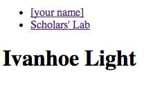

Now we just need the application to start doing some work!

## Working With the Database

Right now our application doesn't know anything about the database we
created for it. The first thing we need to do is include the `db.php`
file with the connection information in it, then tell PHP how to connect
to the database. In the `index.php` file, add the following at the top
of the file (before the `<!DOCTYPE html>` line:

```php
<?php
include_once('db.php');

$connection = mysqli_connect(
  $host,
  $username,
  $password,
  $database) or die(
    '<p class="error">Could not connect to database server.</p>'
  );
?>
```

If you refresh the page now, and everything is working properly, it will
still look the same. All this bit of code did was include the `db.php`
file, and create a connection to the database system using the
[mysqli][mysqli] extension. If PHP cannot establish a connection to the
database server, it will generate a warning message and exit (`die`) the
connection.

Let's add a couple more lines that we can use later. Remember that we
have an entry in the database for the IP address for the user? We can
get that from the [$_SERVER][serverglobal] super global with the `REMOTE_ADDRESS` variable. We
also also to keep track of the actual page we're on, which we can look
up with the `PHP_SELF` variable.


```php
$self = $_SERVER['PHP_SELF']; // this file
$ipaddress = ("$_SERVER[REMOTE_ADDR]"); // the user's IP
```

Now is a good time to create a good commit in git. This is also a good
time to read Tim Pope's [A Note About Git Commit Messages][messages]. Go
ahead and read that, I'll wait here...


## A Simple Form

We need a way to pass information to our application here. In HTML, you
do this with a **form**. We want to create a form that contains all the
data we need to store in the database (name, email address, move, and ip
address), so we need to define those as HTML elements. In the `<main>`
element (after the `<h1>` heading), add the following form:

```php
<form action="<?php echo $self?>" method="post">
  <div class="field">
    <label for="name">Name:</label>
    <input type="text" id="name" name="name" placeholder="Your name..." required="true" />
  </div>

  <div class="field">
    <label for="email">Email:</label>
    <input type="email" id="email" name="email" placeholder="Your email address..." required="true" />
  </div>

  <div class="field">
    <label for="move">Move:</label>
    <textarea name="move" rows="10" cols="40" placeholder="Your move..." required="true"></textarea>
  </div>

  <input type="submit" value="Make Move" />
</form>
```

The first thing here is that we create a form that posts to itself (the
`index.php` script) using a `POST` HTTP method. Next wrap each field in
an HTML `div` element, then create a label and input field for each
field I am using. But what about the IP address? Since that gets set
already, we don't actually have to use that in the form, so we can
ignore that.

I'm also using some fancy HTML5 attributes on the elements to get the 
browser to actually help validate the data the user submits *before* 
processing this by the script. This helps reduce the amout of code you
need to write to ensure the data you are getting from the user matches
what you actually expect!

If you refresh the page, you should see a nice form on your page.

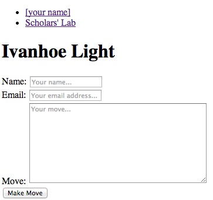

You can now fill out the form and submit it, but if you do, you'll
notice that nothing actually happens. We need to add some code to the
PHP section at the top of `index.php` to actually do something with the
information that it receives through the form's `POST` method. 

Under the `$ipaddress` variable you created, add the following block of
code:

```php
if($_SERVER['REQUEST_METHOD'] == 'POST') {
  // check the parameters
  if(empty($_POST['name']) || empty($_POST['email']) || empty($_POST['move'])){
    echo '<p class="error">You did not fill out the form.</p>';
  } else {
    if($stmt = $connection->prepare("INSERT INTO moves(name, email, move, ipaddress) VALUES (?, ?, ?, ?)")) {
      $stmt->bind_param('ssss', $name, $email, $move, $ipaddress);

      // set the variables
      $name = htmlspecialchars(mysqli_real_escape_string($connection, $_POST['name']));
      $email = htmlspecialchars(mysqli_real_escape_string($connection, $_POST['email']));
      $move = htmlspecialchars(mysqli_real_escape_string($connection, $_POST['move']));

      $stmt->execute(); //execute the insert
      $stmt->close(); // close the connection for writing

      echo '<p class="success">Your move was recorded</p>';
    }
  }
}
```


There is a lot going on here. The first line checks to see if the request is a POST (from a form).
If the request is made through a form, it then checks to ensure that the `name`, `email`, and `move`
 were passed (and yes, there are ways to submit a form without a web
browser, so you need to check it on the server too). If there's an
error, the script will generate an error message for the user.


If everything checks out, we need to get the data in to the database.
For this, we use a language called SQL, and to ensure there aren't any
shenanigans from crafty web users, we add the data as a [prepared
statment][preparedstatement]. Within this statement, we do some further scrubbing of the
strings to take out any HTML code, and properly escaping any special characters
(including statements to delete data). But why? If you allow users to
upload HTML (which includes JavaScript), you open yourself up to many types of
<a href="http://en.wikipedia.org/wiki/Cross-site_scripting">XSS attacks</a>.
Trust me, you don't want that, so we scrub everything that goes in to
the database.


## Displaying Moves
We can now submit data and save it in the database, but there's no
actual data on the screen. We need to tell PHP to go and get all the
data and then actually display it on the screen. We'll take care of retrieving the data first, then tell the script how to present the information to the end user. After the block of code that processes the form data, add the following:


```php
$sql = "SELECT * FROM moves ORDER BY `id` DESC LIMIT 10";
$moves = mysqli_query($connection, $sql);
```

This bit of code creates an SQL statement that selects all of the fields
from the last 10 records added to the moves table, then stores the
results in an associative array named `$moves`.

We want these to display before the form is listed to make users scroll
past the moves. So, before the `form` element on the page, add this:

```php
<div id="moves">
  <ul>
  <?php while($row = mysqli_fetch_array($moves)): ?>
    <li>
      <div class="meta"><p><?php echo $row['name']; ?></p></div>
      <div class="move"><?php echo $row['move']; ?></div>
    </li>
  <?php endwhile; ?>
   </ul>
</div>
```

This uses a `while` loop that will loop over the `$moves` while there
are elements in the array. Each row of data is then stored as an array
of data in the variable `$row`.

If you look at the application in the browser, you should have something
that looks like this:

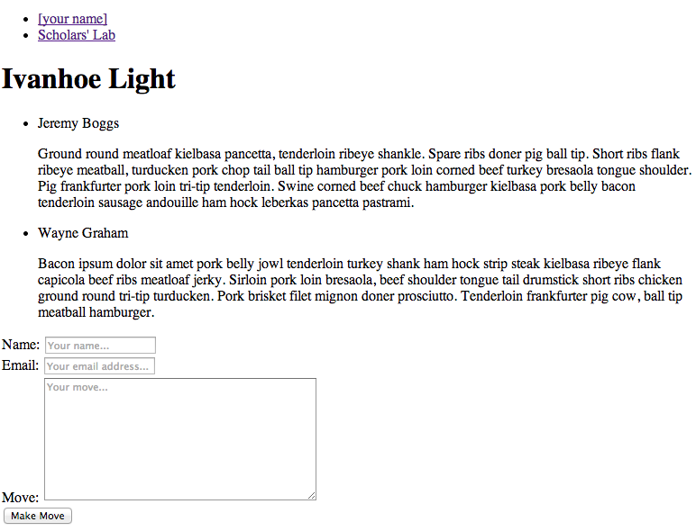

Now that you have a new feature working, it's another good time to stop and commit these changes with `git`. If
you didn't read [Tim Pope's][messages] article earlier, you should *really* go read
that.


### Getting Fancy

You know, one nice little feature to have would be to actually use the
Gravatar service to display an image next to the user's move. Gravatar
uses a `hash` of the user's email address to return the image, so we'll
need to write a function that can help us create the URL for the image.

For this function, we need to take a image (and an optional size to make
this more flexible), and remove any whitespace that may be in the
string, make sure it's lower-case, and run it through a hash function
using the md5 algorithm. At the top of the `index.php` page, add the
following function (under the `include_once` line):

```php
function gravatar_url($email, $size=70)
{
  $hash = md5(strtolower(trim($email)));
  $url = "http://www.gravatar.com/avatar/$hash?s=$size";
  return $url;
}
```

We can now use this in the `while` loop we made earlier to create a link
to the user's gravatar image. In the `meta` class we just added, add an
image with a URL set to the `gravatar_url` method:

```php
<div class="meta">
  " alt="Gravatar"/>
  <p><?php echo $row['name']; ?></p>
</div>
```

Now if you refresh the page, you should see gravatar images next to each
move.

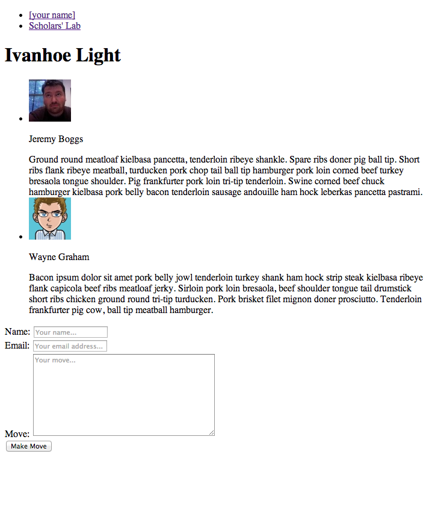

## Style

We have a really solid base now to start working with, but right now we
just have the default styles that the browser applies. We can do a lot
better. Let's fix this to look better with a bit of styling in CSS.

The first thing we want to do is style some of the major HTML blocks
we've defined in the code, moving the content in to the center of the
page, giving it a background color, and a better font.

```css
html {
  background: #fffddd;
}

body {
  font-family: "Helvetica Neue", Helvetica, Arial, sans-serif;
  margin: 0 auto;
  width: 900px;
  color: #444;
}

a:link { color: #700; }
a:visited { color: #b00; }
a:hover { color: #b00; text-decoration: none; }
a:active { color: #500; }

nav {
  display: block;
  border: 1px solid #ccc;
  border-width: 1px 0;
}

nav a {
  text-decoration: none;
  color: #777;
}

nav ul {
  list-style: none;
  padding-left: 0;
}

nav li {
  display: inline;
}

nav li + li:before {
  content: " · ";
  color: #ccc;
}
```

When you refresh the page now, you should see something that looks like
this:

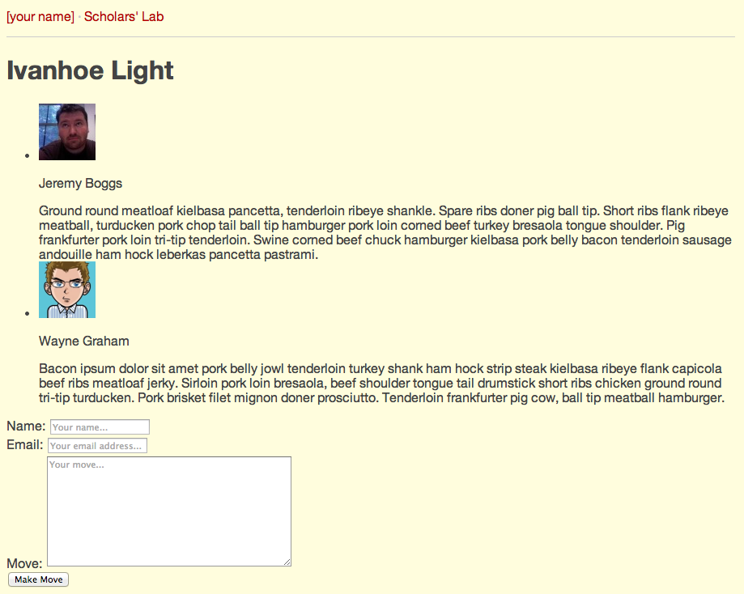

It's starting to look like something! Now a few styles for the
notification messages we created. This will create red/green boxes with
rounded edges to display when a move has been made:

```css
p.error {
  color: #a94442;
  background-color: #f2dede;
  border: 1px solid #ebccd1;
  padding: 15px;
  margin-bottom: 15px;
  border-radius: 4px;
  box-sizing: border-box;
}

p.success {
  background-color: #dff0d8;
  color: #3c763d;
  border: 1px solid #d6e9c6;
  padding: 15px;
  margin-bottom: 20px;
  border-radius: 4px;
  box-sizing: border-box;
}
```

I'll fake this a bit, but the feedback from posting the data in the to
the database will look like this:

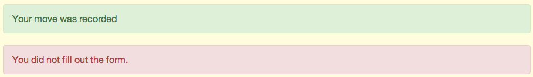

Awesome, now let's work on styling the moves. Basically what we want to
do here is put the image on the left, with the content of the move on
the right, styling the list items to not display the circle:

```css
#moves ul {
  margin-left: 0;
  margin-bottom: 15px;
}

#moves li {
  list-style: none;
  clear: both;
  padding-top: 30px;
}

#moves li:first-child {
  padding-top: 0;
}

.meta {
  width: 85px;
  min-height: 110px;
  font-weight: bold;
  float: left;
}

.meta img {
  padding: 5px;
  background-color: #313d60;
}

.meta p {
  padding-top: 5px;
  float: left;
}

.move {
  width: 700px;
  margin-left: 110px;
}
```

This styles the moves list to remove the circules, then styles the
`meta` image and name, then sets the `move` content to `700px` to fill
out the page.

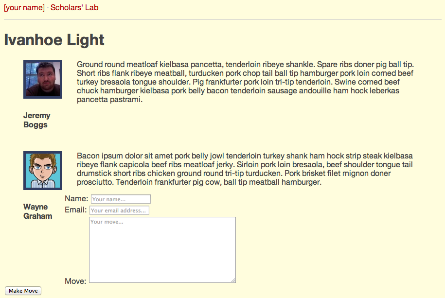

But that form is still a little gross looking, especially since the form
doesn't look right since it's in the `moves` section. Let's fix the form 
up a bit that by moving the form down, making the text input larger,
 and adding some visual queues for which field the
user is in. We'll use some browser-specfici extensions, as well as
advanced selectors. 

```css
form {
  clear: both;
}

.field {
  margin-bottom: 15px;
}

label {
  margin-bottom: 5px;
  font-weight: bold;
}

input:not([type='submit']) {
  display: block;
  width: 100%;
  height: 34px;
  padding: 6px 12px;
  margin: 6px 0 0 0;
  font-size: 14px;
  line-height: 1.428571429;
  color: #555;
  vertical-align: middle;
  border: 1px solid #ccc;
  border-radius: 4px;
  -webkit-box-shadow: inset 0 1px 1px rgba(0,0,0,0.075);
  box-shadow: inset 0 1px 1px rgba(0,0,0,0.075);
  -webkit-transition: border-color ease-in-out .15s, box-shadow ease-in-out .15s;
  transition: border-color ease-in-out .15s, box-shadow ease-in-out .15s;
}

input[type='submit'] {
  padding: 6px 12px;
  margin-bottom: 0;
  font-size: 14px;
  font-weight: normal;
  line-height: 1.428571429;
  text-align: center;
  white-space: nowrap;
  vertical-align: middle;
  cursor: pointer;
  border-radius: 4px;
  -webkit-user-select: none;
  -moz-user-select: none;
  -ms-user-select: none;
  -o-user-select: none;
  color: #333;
  background-color: #fff;
  border-color: #adadad;
  text-decoration: none;
}

textarea {
  display: block;
  width: 100%;
  height: auto;
  padding: 6px 12px;
  font-size: 14px;
  line-height: 1.428571429;
  color: #555;
  vertical-align: middle;
  background-color: #fff;
  border: 1px solid #ccc;
  border-radius: 4px;
  -webkit-box-shadow: inset 0 1px 1px rgba(0,0,0,0.075);
  box-shadow: inset 0 1px 1px rgba(0,0,0,0.075);
  -webkit-transition: border-color ease-in-out .15s,box-shadow ease-in-out .15s;
  transition: border-color ease-in-out .15s,box-shadow ease-in-out .15s;
}
```

Looking good, but for good measure, let's give the footer some love:

```css
footer {
  padding: 30px 0;
  display: block;
}
```

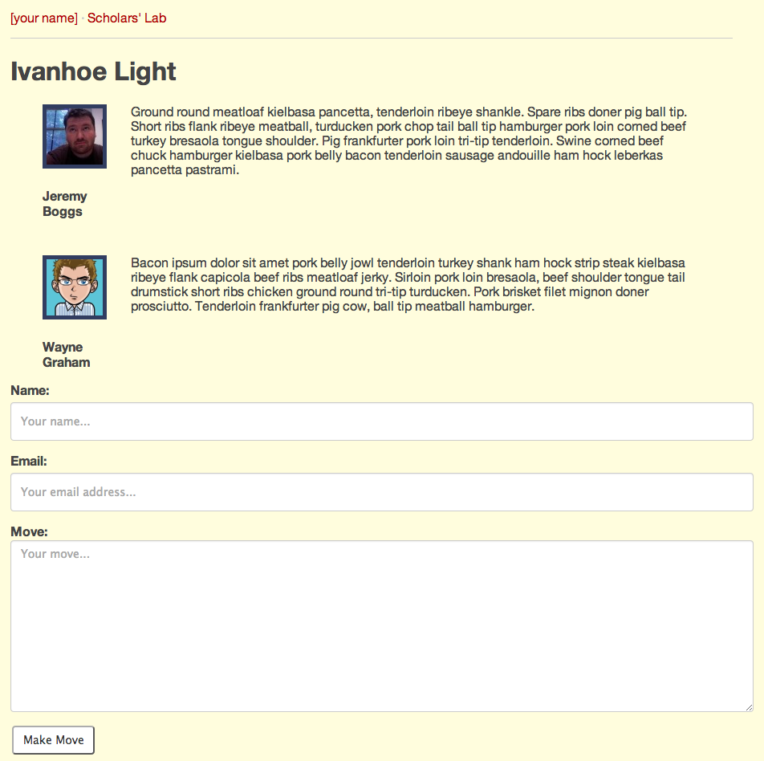

This is a good start, but there is a lot more you could do to improve
this from a user's perspective. This is where your imagination,
intention, and search for "good" design comes in to play.

# Summary

So this very brief tutorial worked through developing a simple PHP
application that stores information in a database, and styling the
results. However, this is just a start, and hand-waves over a lot of the
complexities of building a web-based application for modern browsers.
This *hopefully* help you understand how applications are typcially
built, layering functionality to get something working, then
progressively enhancing the functionality until you have fully
implemented all the features you need.

## Going Further

If you are really motivated, here are some prompts to help you take this
application even further.

* Make this design better with your own CSS
* How might you think about providing all of the moves, without making
  the page super long?
* Add a WSYIWYG editor to the **Moves** field
* Change the application to allow moves on a move
  * What needs to change in the design of the page?
  * What needs to change in the database?
  * How do you tell your application which form you're talking about?
* What are other features you could add?
* How could you use the same data to produce a different visualization
  of the data? 
* Are there any interactions that could be refined to make interacting
  with the application easier?

[mamp]: http://www.mamp.info/en/index.html
[wamp]: http://www.wampserver.com/en/
[mysqli]: http://www.php.net/mysqli
[serverglobal]: http://php.net/manual/en/reserved.variables.server.php
[messages]: http://tbaggery.com/2008/04/19/a-note-about-git-commit-messages.html
[preparedstatement]: http://en.wikipedia.org/wiki/Prepared_statement

